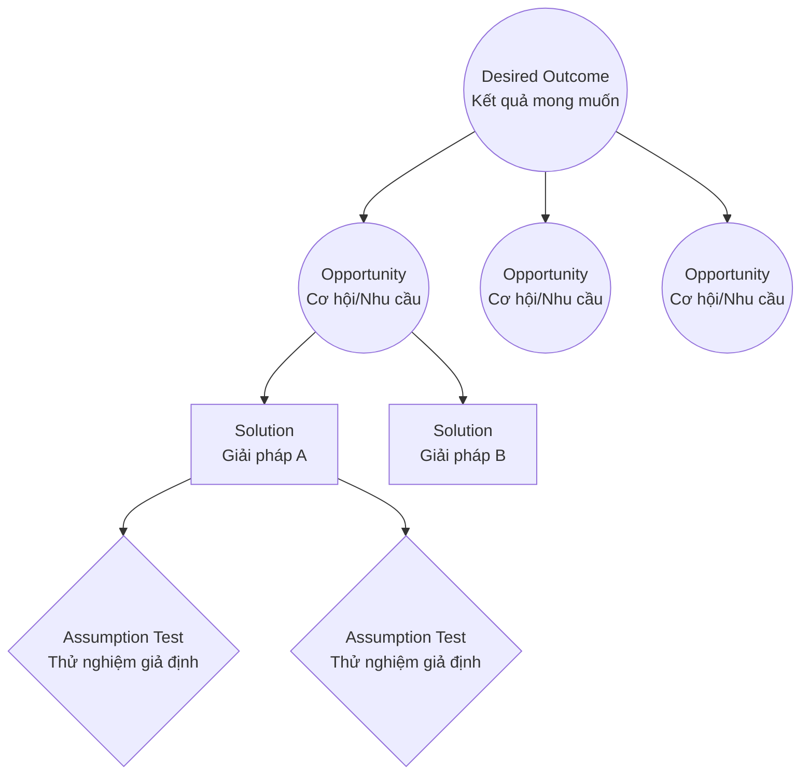

# Part 1: Foundations (Phần 1: Nền tảng)

## Foreword (Lời nói đầu)

### Core Summary (Tóm tắt cốt lõi)
*   **Chuyển đổi tư duy**: Chuyển từ việc chỉ tập trung vào đầu ra (outputs) và các quy trình rời rạc sang một quy trình khám phá có cấu trúc, tập trung vào kết quả (outcomes) và hiểu biết sâu sắc về khách hàng.
*   **Vai trò của huấn luyện**: Marty Cagan nhấn mạnh tầm quan trọng của việc huấn luyện (coaching) để các nhóm sản phẩm không chỉ biết lý thuyết mà còn biết cách thực hiện khám phá sản phẩm hiệu quả.
*   **Lợi ích thực tế**: Áp dụng các thói quen khám phá giúp tăng sự tự tin cho nhóm, cải thiện sự hợp tác giữa các bộ phận và tạo ra các sản phẩm mang lại giá trị thực sự cho cả khách hàng và doanh nghiệp.

### Detailed Content (Nội dung chi tiết)

**Chris Mercuri** chia sẻ về hành trình của nhóm ông khi áp dụng *Continuous Discovery Habits*. Trước đây, họ thường xuyên thay đổi cách tiếp cận và cần nhiều cuộc họp để quyết định làm gì tiếp theo. Sau khi áp dụng các thói quen này, họ đã chuyển dịch:
*   Từ hiểu biết hời hợt sang hiểu biết sâu sắc về nhu cầu và mong muốn của khách hàng thông qua tiếp xúc thường xuyên.
*   Từ danh sách các chỉ số cần tăng và tính năng cần giao (outputs) sang tập trung giải quyết vấn đề của khách hàng để thúc đẩy giá trị kinh doanh.
*   Từ việc "yêu" một ý tưởng duy nhất sang việc thử nghiệm nhiều ý tưởng và học hỏi nhanh chóng.
*   Từ việc tách biệt Khám phá (Discovery) và Chuyển giao (Delivery) sang sự hợp tác chặt chẽ của toàn bộ nhóm (Product Manager, Designer, Engineer).

**Marty Cagan** nhấn mạnh rằng nhiều nhóm sản phẩm muốn làm tốt nhưng thiếu sự hướng dẫn thực tế. Cuốn sách này lấp đầy khoảng trống đó bằng cách cung cấp cấu trúc và các bước cụ thể ("how") chứ không chỉ là lý thuyết ("what").

---

## Introduction (Giới thiệu)

### Core Summary (Tóm tắt cốt lõi)
*   **Bối cảnh**: Tác giả Teresa Torres chia sẻ hành trình từ một người làm sản phẩm thất vọng với các mô hình kinh doanh cũ sang một huấn luyện viên khám phá sản phẩm (product discovery coach).
*   **Mục tiêu**: Cuốn sách cung cấp một bộ các thói quen (habits) bền vững giúp các nhóm sản phẩm khám phá, lặp lại và tinh chỉnh sản phẩm để tạo ra giá trị cho khách hàng và doanh nghiệp.

### Detailed Content (Nội dung chi tiết)
Teresa Torres nhận ra rằng nhiều công ty, đặc biệt là các startup, rơi vào bẫy của việc chạy theo doanh số tiếp theo hoặc ám ảnh về đối thủ cạnh tranh vì họ không có một mô hình quản lý sản phẩm tốt hơn.

Cuốn sách này giới thiệu khung *Continuous Discovery* giúp các nhóm:
*   Khám phá các sản phẩm mới và cải tiến sản phẩm hiện có.
*   Liên tục khám phá các nhu cầu chưa được đáp ứng của khách hàng.
*   Tìm ra các giải pháp giải quyết những nhu cầu đó.

---

## Chapter 1: The What and Why of Continuous Discovery (Chương 1: Continuous Discovery là gì và Tại sao cần nó?)

### Core Summary (Tóm tắt cốt lõi)
*   **Phân biệt Discovery & Delivery**: Discovery là quyết định *cái gì* cần xây dựng. Delivery là công việc xây dựng và chuyển giao sản phẩm đó.
*   **Định nghĩa Continuous Discovery**: Tiếp xúc hàng tuần với khách hàng để thực hiện các hoạt động nghiên cứu nhỏ nhằm theo đuổi một kết quả mong muốn.
*   **Product Trio**: Mô hình làm việc cộng tác giữa Product Manager, Designer và Software Engineer.
*   **6 Tư duy tiên quyết**: Hướng kết quả, Tập trung vào khách hàng, Cộng tác, Trực quan hóa, Thực nghiệm, và Liên tục.

### Visuals/Diagrams (Biểu đồ/Hình ảnh)

**The Product Trio (Bộ ba sản phẩm)**

```mermaid
graph TD
    PM[Product Manager<br>(Quản lý sản phẩm)] --- Designer[Designer<br>(Nhà thiết kế)]
    Designer --- Engineer[Software Engineer<br>(Kỹ sư phần mềm)]
    Engineer --- PM
    style PM fill:#f9f,stroke:#333,stroke-width:2px
    style Designer fill:#bbf,stroke:#333,stroke-width:2px
    style Engineer fill:#dfd,stroke:#333,stroke-width:2px
```

*Mô tả: Product Trio là sự hợp tác bình đẳng giữa ba vai trò cốt lõi để cùng ra quyết định về sản phẩm, thay vì làm việc theo mô hình chuyển giao (hand-off) truyền thống.*

### Detailed Content (Nội dung chi tiết)

**Sự tiến hóa của Khám phá Sản phẩm (Modern Product Discovery)**
Ngành công nghiệp phần mềm đã chuyển dịch từ mô hình Waterfall (thác nước) với chu kỳ dài sang Agile với chu kỳ ngắn hơn. Tuy nhiên, nhiều nơi vẫn giữ tư duy "dự án" trong vỏ bọc Agile (Scrum/Kanban), tập trung quá nhiều vào *Delivery* (giao hàng đúng hạn) mà quên mất *Discovery* (xây dựng đúng cái cần xây).

**Định nghĩa Continuous Discovery (Khám phá liên tục)**
Teresa Torres định nghĩa một nhóm thực hiện *Continuous Discovery* khi họ đạt được các tiêu chí sau:
> "Tối thiểu, có các điểm chạm hàng tuần với khách hàng (weekly touchpoints).
> Được thực hiện bởi nhóm xây dựng sản phẩm (Product Trio).
> Nơi họ thực hiện các hoạt động nghiên cứu nhỏ.
> Để theo đuổi một kết quả mong muốn (desired outcome)."

Mục tiêu là đưa tiếng nói khách hàng vào mọi quyết định hàng ngày của nhóm sản phẩm.

**Product Trio (Bộ ba sản phẩm)**
Để thành công, *Discovery* không thể chỉ là việc của PM. Nó cần sự tham gia của Product Trio:
1.  **Product Manager**: Mang đến bối cảnh kinh doanh (khả thi về mặt kinh doanh - Viability).
2.  **Designer**: Đảm bảo trải nghiệm người dùng (khả dụng và đáng mong ước - Usability & Desirability).
3.  **Software Engineer**: Đảm bảo tính khả thi về công nghệ (Feasibility).

**6 Tư duy tiên quyết (The Prerequisite Mindsets)**
Để áp dụng thành công, nhóm cần nuôi dưỡng 6 tư duy:
1.  **Outcome-oriented (Hướng kết quả)**: Tập trung vào giá trị tạo ra (outcomes) thay vì tính năng được giao (outputs).
2.  **Customer-centric (Tập trung vào khách hàng)**: Đặt khách hàng ở trung tâm, phục vụ nhu cầu của họ để tạo ra lợi nhuận.
3.  **Collaborative (Cộng tác)**: Làm việc cùng nhau thay vì làm việc trong các "silô" riêng biệt.
4.  **Visual (Trực quan)**: Sử dụng hình ảnh, sơ đồ để "ngoại hóa" tư duy và tạo sự thấu hiểu chung.
5.  **Experimental (Thực nghiệm)**: Tư duy như nhà khoa học, xác định giả định và thu thập bằng chứng.
6.  **Continuous (Liên tục)**: Chuyển từ tư duy dự án (làm một lần rồi thôi) sang tư duy liên tục (học hỏi và thích nghi).

---

## Chapter 2: A Common Framework for Continuous Discovery (Chương 2: Một khung chung cho Khám phá liên tục)

### Core Summary (Tóm tắt cốt lõi)
*   **Cấu trúc nền tảng**: Sử dụng *Opportunity Solution Tree (OST)* để trực quan hóa và quản lý quá trình khám phá.
*   **Giải quyết vấn đề phi cấu trúc (Ill-structured problems)**: Khám phá sản phẩm là giải quyết các vấn đề mở, không có một đáp án đúng duy nhất. Cần đóng khung vấn đề (framing) tốt.
*   **Cấu trúc OST**: Kết quả (Outcome) -> Cơ hội (Opportunity) -> Giải pháp (Solution) -> Thử nghiệm giả định (Assumption Test).
*   **Lợi ích**: Giúp đồng bộ hóa nhóm, tránh bẫy "yêu giải pháp đầu tiên", và cho phép so sánh các lựa chọn một cách khách quan.

### Visuals/Diagrams (Biểu đồ/Hình ảnh)

**The Opportunity Solution Tree (Cây Cơ hội - Giải pháp)**



*Mô tả cấu trúc:*
1.  **Root (Gốc)**: Desired Outcome (Kết quả kinh doanh mong muốn).
2.  **Branches (Cành)**: Opportunity Space (Không gian cơ hội - nhu cầu, nỗi đau, mong muốn của khách hàng).
3.  **Leaves (Lá)**: Solution Space (Không gian giải pháp - các ý tưởng tính năng).
4.  **Below Leaves (Dưới lá)**: Assumption Tests (Các thử nghiệm để kiểm chứng giả định).

### Detailed Content (Nội dung chi tiết)

**Cấu trúc cơ bản của Khám phá**
Nhiều nhóm gặp khó khăn vì không biết phải làm gì tiếp theo trong quá trình khám phá lộn xộn. *Opportunity Solution Tree (OST)* cung cấp một bản đồ trực quan:
1.  **Outcome (Kết quả)**: Bắt đầu bằng việc xác định giá trị kinh doanh cần đạt được.
2.  **Opportunity (Cơ hội)**: Khám phá và lập bản đồ các nhu cầu, nỗi đau, mong muốn của khách hàng. Nếu giải quyết được những điều này, kết quả kinh doanh sẽ đạt được. Đây là bước "đóng khung vấn đề" (problem framing).
3.  **Solution (Giải pháp)**: Các ý tưởng để giải quyết cơ hội đã chọn.
4.  **Assumption Test (Thử nghiệm giả định)**: Cách đánh giá giải pháp nhanh chóng mà không cần xây dựng toàn bộ sản phẩm.

**Lợi ích của OST**
*   **Giải quyết căng thẳng giữa nhu cầu kinh doanh và khách hàng**: Bằng cách bắt đầu từ Outcome (kinh doanh) nhưng đi qua Opportunity (khách hàng), nhóm đảm bảo tạo ra giá trị cho cả hai phía.
*   **Tư duy so sánh (Compare and Contrast)**: Thay vì hỏi "Chúng ta có nên làm tính năng này không?" (câu hỏi Yes/No dễ dẫn đến thiên kiến xác nhận), OST giúp hỏi "Trong các cơ hội này, cái nào hứa hẹn nhất?" hoặc "Trong các giải pháp này, cái nào giải quyết nhu cầu tốt nhất?".
*   **Tránh bẫy "Delivery"**: Giúp nhóm không nhảy ngay vào giải pháp (solutions) mà phải hiểu rõ vấn đề (opportunities) trước.
*   **Quản lý các bên liên quan (Stakeholders)**: OST là công cụ tuyệt vời để trình bày tư duy của nhóm ("Show your work"). Thay vì chỉ báo cáo kết luận, nhóm cho thấy các lựa chọn đã cân nhắc và lý do chọn lựa, giúp các bên liên quan dễ dàng đóng góp và đồng thuận.

---

## Glossary (Thuật ngữ)

| Thuật ngữ Tiếng Anh | Giải thích Tiếng Việt | Ghi chú |
| :--- | :--- | :--- |
| **Continuous Discovery** | Khám phá liên tục | Quá trình liên tục tìm hiểu nhu cầu khách hàng để đưa ra quyết định sản phẩm tốt hơn. |
| **Product Trio** | Bộ ba sản phẩm | Nhóm nòng cốt gồm Product Manager, Designer, và Engineer cùng làm việc và ra quyết định. |
| **Opportunity Solution Tree (OST)** | Cây Cơ hội - Giải pháp | Một biểu đồ trực quan giúp kết nối Kết quả kinh doanh với Nhu cầu khách hàng và Giải pháp. |
| **Outcome** | Kết quả | Giá trị đo lường được mà sản phẩm mang lại (cho doanh nghiệp hoặc khách hàng), khác với Output (sản phẩm đầu ra). |
| **Output** | Đầu ra | Các tính năng, sản phẩm cụ thể được xây dựng và chuyển giao. |
| **Opportunity** | Cơ hội | Trong bối cảnh cuốn sách này, nó bao gồm nhu cầu (needs), nỗi đau (pain points), và mong muốn (desires) của khách hàng. |
| **Assumption Test** | Thử nghiệm giả định | Các thí nghiệm nhỏ, nhanh để kiểm chứng các giả định rủi ro nhất của một ý tưởng. |
| **Ill-structured problem** | Vấn đề phi cấu trúc | Các vấn đề không có một giải pháp duy nhất đúng, cần phải được "đóng khung" (frame) để giải quyết. |
