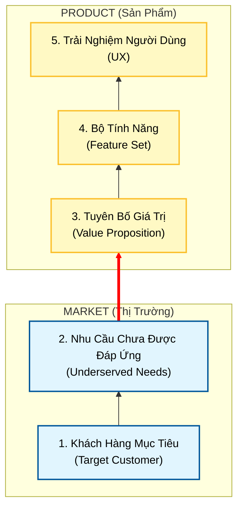

# Module 0: Nền Tảng & Tư Duy Cốt Lõi

Chào mừng bạn đến với hành trình **Lean Product Playbook**! Tôi là **Agent A**, người đồng hành cùng bạn để biến ý tưởng thành sản phẩm thực tế mà khách hàng khao khát.

Chúng ta sẽ không bắt đầu bằng việc viết code hay vẽ giao diện. Chúng ta sẽ bắt đầu bằng **tư duy**.

---

## 🎯 Mục Tiêu Của Bạn
Sau module này, bạn sẽ:
1.  Hiểu rõ **lý do số 1** khiến các sản phẩm thất bại (để tránh vết xe đổ đó).
2.  Nắm vững mô hình **Kim Tự Tháp Product-Market Fit**.
3.  Phân biệt rạch ròi giữa **Không gian Vấn đề** (Problem Space) và **Không gian Giải pháp** (Solution Space).

---

## 🗺️ Bản Đồ Định Hướng: Kim Tự Tháp Product-Market Fit

Để xây dựng một sản phẩm thành công, bạn cần một nền móng vững chắc. Hãy nhìn vào mô hình dưới đây. Chúng ta đang ở chân kim tự tháp.

> **💡 Định nghĩa: Product-Market Fit (Sự phù hợp giữa Sản phẩm và Thị trường)**
> Là khi sản phẩm của bạn (3 tầng trên) giải quyết hoàn hảo nhu cầu của thị trường (2 tầng dưới) tốt hơn bất kỳ giải pháp nào khác.

---

## 🧠 Tư Duy Cốt Lõi

### 1. Tại sao sản phẩm thất bại?
Bạn có biết phần lớn các sản phẩm mới đều thất bại không? Lý do không phải vì đội ngũ kỹ thuật kém, hay thiết kế xấu.
**Lý do chính:** Chúng ta xây dựng một sản phẩm mà **không ai cần**. Chúng ta không đạt được *Product-Market Fit*.

### 2. Vấn đề (Problem) vs. Giải pháp (Solution)
Đây là khái niệm quan trọng nhất bạn cần nhớ.
*   **Không gian Vấn đề (Problem Space)**: "Cái gì" (What) khách hàng cần. Nhu cầu, nỗi đau, mong muốn của họ.
*   **Không gian Giải pháp (Solution Space)**: "Cách" (How) bạn giải quyết vấn đề đó. Tính năng, công nghệ, thiết kế.

> ⚠️ **Cạm bẫy:** Hầu hết các team nhảy ngay vào *Giải pháp* (xây dựng app, web) trước khi hiểu rõ *Vấn đề*.

---

## 🔍 Case Study Spotlight: Cây Bút Không Gian NASA

Hãy xem xét câu chuyện kinh điển này để hiểu rõ sự khác biệt giữa Vấn đề và Giải pháp.

**Tình huống:** Các phi hành gia cần viết ở môi trường không trọng lực. Bút bi thường không ra mực.

| Cách tiếp cận | Tư duy | Kết quả |
| :--- | :--- | :--- |
| **Tập trung vào Giải pháp** | "Tôi cần tạo ra một cây bút viết được trong vũ trụ." | **NASA (theo giai thoại):** Chi hàng triệu đô R&D để chế tạo bút bơm khí nén. |
| **Tập trung vào Vấn đề** | "Tôi cần một cách để ghi chép trong môi trường không trọng lực." | **Người Nga:** Dùng bút chì. |

> **Bài học:** Đừng cố gắng tạo ra "cây bút xịn nhất". Hãy tập trung vào việc "ghi chép". Khi bạn hiểu rõ vấn đề, giải pháp có thể đơn giản đến bất ngờ.

---

## 🛠️ Bài Tập Thực Hành: Xác Định "Problem Space"

Hãy dừng lại một chút. Đừng nghĩ về app hay website bạn định làm. Hãy điền vào chỗ trống dưới đây:

**1. Khách hàng của tôi là ai?** (Đừng nói "tất cả mọi người")
................................................................................................

**2. Vấn đề thực sự của họ là gì?** (Không phải "họ cần app của tôi", mà là "họ gặp khó khăn khi...")
................................................................................................

**3. Hiện tại họ đang giải quyết vấn đề đó như thế nào?** (Đối thủ cạnh tranh có thể là bút chì, file Excel, hoặc... không làm gì cả)
................................................................................................

---
*Sẵn sàng chưa? Hãy di chuyển sang **Module A** để bắt đầu đào sâu vào Thị Trường!*
