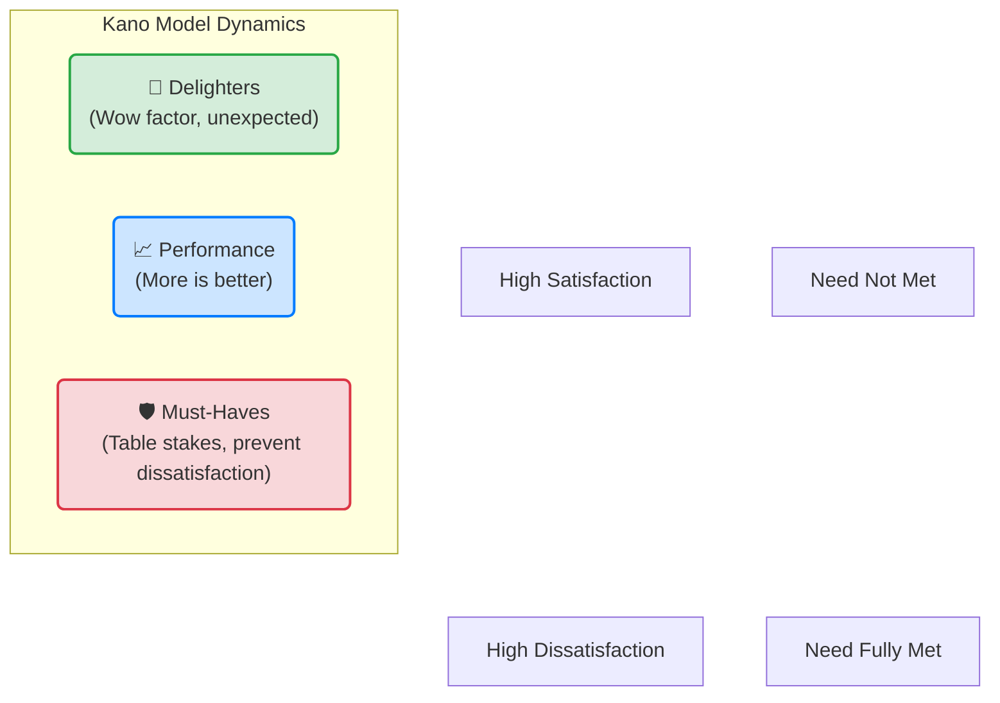

# Module B: Product Definition – Value & Scope

**🎯 The Goal**: To define a winning Value Proposition and specify a Minimum Viable Product (MVP) feature set that delivers it without waste.

---

## 🗺️ Navigation: The Product-Market Fit Pyramid

We are moving up the pyramid from Market (Problem Space) to Product (Solution Space).

```mermaid
graph TD
    subgraph Product [Product (Solution Space)]
        UX[User Experience]
        FS[Feature Set]:::current
        VP[Value Proposition]:::current
    end
    subgraph Market [Market (Problem Space)]
        UN[Underserved Needs]
        TC[Target Customer]
    end

    UX --- FS
    FS --- VP
    VP --- UN
    UN --- TC

    classDef current fill:#f96,stroke:#333,stroke-width:4px;
```

---

## 🧠 Core Concepts: The Kano Model

Strategy means saying "No". You cannot build everything. To define a unique **Value Proposition**, you must decide how you compare to competitors. The **Kano Model** is the perfect framework for this decision-making.

It categorizes features based on how they affect customer satisfaction:

1.  **Must-Haves (Basic Needs)**:
    *   **Definition**: Features that customers expect. If missing, they are dissatisfied. If present, they are just neutral (not delighted).
    *   *Example*: Seatbelts in a car. You don't buy a car *because* it has seatbelts, but you won't buy it if it doesn't.
    *   *Strategy*: You **must** have these, but you don't compete here.

2.  **Performance Benefits (More is Better)**:
    *   **Definition**: Satisfaction increases linearly with performance.
    *   *Example*: MPG in a car, or battery life in a phone.
    *   *Strategy*: **Pick one** key performance dimension to outperform competitors on.

3.  **Delighters (Excitement Features)**:
    *   **Definition**: Unexpected features that create high satisfaction. Their absence doesn't cause dissatisfaction (because they aren't expected).
    *   *Example*: GPS when it first launched in cars.
    *   *Strategy*: Include **at least one** unique delighter.

### 📊 Visualizing the Kano Model



*(Note: In a detailed chart, Delighters curve exponentially up, Performance is a linear 45-degree line, and Must-haves curve logarithmically, flattening at neutral).*

---

## 🔍 Case Study Spotlight: The Search Engine Wars

Why did **Google** win and **Cuil** fail? It comes down to Value Proposition selection.

### The Battlefield
Early search engines competed on three performance attributes:
1.  **Number of results** (Index size)
2.  **Freshness** (How new the pages are)
3.  **Relevance** (Finding exactly what you want)

### Google's Strategy
*   **Must-haves**: Basic search functionality.
*   **Performance**: They bet the farm on **Relevance** (PageRank). While others fought over index size, Google ensured the *first* result was the *right* result.
*   **Delighters**: Minimalist homepage (speed), Google Suggest (saving time).

### The Failure of Cuil (2008)
*   **The Pitch**: Cuil launched claiming a 3x larger index than Google (Performance benefit: Number of results).
*   **The Reality**: Users didn't care about *more* results; they cared about *relevant* results. Cuil's relevance was poor.
*   **The Lesson**: Winning on the wrong performance attribute (Index Size) while failing on the critical one (Relevance) leads to failure.

---

## 🛠️ Actionable Worksheet: Define Your Value Prop & MVP

Use this template to define your strategy. **Don't** try to be better at everything.

### Step 1: The Strategy Grid

| Feature / Benefit | Competitor A | Competitor B | **My Product** (You) |
| :--- | :--- | :--- | :--- |
| **Must-Haves** (List them) | ✅ Yes | ✅ Yes | **✅ Yes** (Required) |
| **Performance Benefit 1** | High | Low | **Medium** |
| **Performance Benefit 2** (Your Core?) | Medium | High | **High (The Winner)** |
| **Delighter 1** | Yes | No | **No** |
| **Delighter 2** (Your Secret Sauce) | No | No | **✅ YES** |

### Step 2: The MVP Feature Set (Scoping)

Take the benefits above and list the specific features required. Then prioritize.

*   **Benefit**: ___________________________________
    *   *Feature Idea*: _____________________________ (ROI: High/Med/Low) -> **MVP?** [ ]
    *   *Feature Idea*: _____________________________ (ROI: High/Med/Low) -> **MVP?** [ ]

*   **Benefit**: ___________________________________
    *   *Feature Idea*: _____________________________ (ROI: High/Med/Low) -> **MVP?** [ ]

**Rule of Thumb**: Your MVP must contain:
1.  All **Must-Haves**.
2.  Superior functionality for **ONE** Performance benefit.
3.  (Optional but recommended) **ONE** Delighter.
