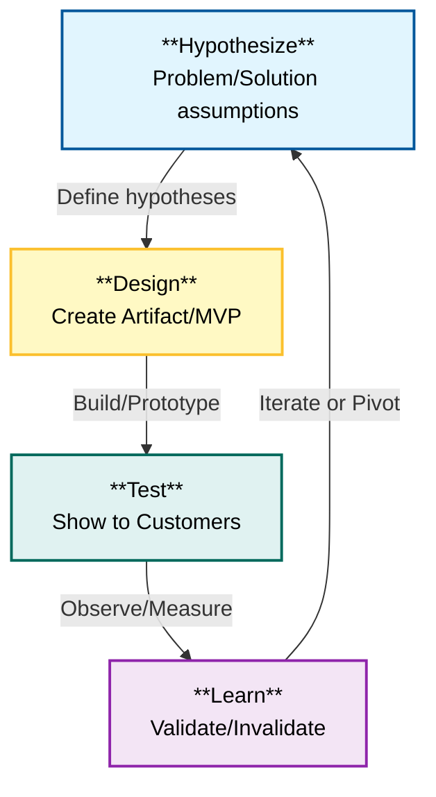

# Module C: Validation (The Moment of Truth)

**Source Material**: *The Lean Product Playbook*, Chapters 7-10

---

## 🎯 The Goal
**Stop guessing.** The goal of this module is to move from **hypotheses** to **validated learning**. You are not building a product yet; you are building *tests* to verify that your target customers actually have the needs you think they have, and that your solution creates value for them.

> *"User testing is the antidote for product blindness."* — Dan Olsen

---

## 🧠 Core Concepts

### 1. The MVP is a Process, Not Just a Product
An MVP (Minimum Viable Product) isn't just a buggy version 1.0. It is a **test artifact** designed to validate specific hypotheses.

**The Matrix of MVP Tests** (Choose the right tool):

| | **Qualitative** (Why?) | **Quantitative** (How many?) |
| :--- | :--- | :--- |
| **Marketing** (Tests Value Prop) | **Interviews/Feedback** Show ads/landing pages to 1-on-1 users to gauge interest. | **Landing Page / Smoke Test** Drive traffic to a page with a "Sign Up" button. Measure conversion. **Explainer Video** (e.g., Dropbox) **Crowdfunding** (e.g., Pebble) |
| **Product** (Tests Solution) | **Wireframes / Mockups** Interactive prototypes (InVision, Figma). **Wizard of Oz / Concierge** Manually performing the service behind the scenes. | **Fake Door** Add a feature button that leads to "Coming Soon". **A/B Testing** Live product experiments. |

### 2. The UX Design Iceberg
Don't just make it "pretty." Great UX is built in layers. If the bottom layers fail, the top layer cannot save the product.

1.  **🧊 Conceptual Design** (Bottom): The underlying metaphor (e.g., "Files in a folder" for Dropbox, "Checkbook" for Quicken).
2.  **🏗️ Information Architecture (IA)**: How the app is structured (Sitemaps, navigation).
3.  **👆 Interaction Design**: User flows, what happens when you click (Wireframes).
4.  **🎨 Visual Design** (Top): Colors, fonts, "pixel perfect" look (Mockups).

### 3. "Ramen" User Testing
You don't need a fancy lab. You need **5-8 users** per wave.
*   **Why 5-8?** Research shows this catches ~80% of major usability issues.
*   **The Cadence**: Test on Thursday -> Fix on Friday -> Test new version next Thursday.
*   **The Golden Rule**: Watch what they *do*, don't just listen to what they *say*.

---

## 🔄 The Hypothesize-Design-Test-Learn Loop

The engine of Lean Product Development. You must complete the loop to learn.

---

## 🔍 Case Study Spotlight

### 🐦 Buffer: The "Smoke Test" MVP
**Hypothesis**: People want a way to queue tweets to post at optimal times.
**The Test**: Joel Gascoigne didn't build the app. He built a 2-page website.
1.  **Page 1**: Value proposition + "Plans & Pricing" button.
2.  **Page 2**: "Hello! You caught us before we're ready" + Email capture field.
**Result**: People clicked and entered emails.
**Iteration**: He added a pricing grid between Page 1 and 2 to test *willingness to pay*. When people clicked the paid plans, he knew he had a business.

### 🏠 Airbnb: The "Concierge" MVP
**Hypothesis**: Listings with professional photos get more bookings.
**The Test**: Instead of building a marketplace for photographers, the founders *manually* went to hosts' houses, took photos, and uploaded them.
**Result**: Bookings doubled or tripled.
**Learning**: Only *after* validating manually did they build the automated "Request a Photographer" feature.

---

## 🛠️ Actionable Worksheet: User Testing Script

**Objective**: Test your Prototype/Wireframe with a potential customer.
**Time**: 45-60 Minutes.

### Part 1: Warm-up & Discovery (10-15 mins)
*Goal: Understand their current reality and problems.*
1.  "Tell me about your role/lifestyle regarding [Topic]."
2.  "Walk me through how you currently solve [Problem]." (Look for workarounds!)
3.  "What is the most frustrating part of that process?"
4.  "If you had a magic wand, what would you change?"

### Part 2: Prototype Feedback (30-40 mins)
*Goal: Test the solution. Do NOT sell. Watch and listen.*
*Set the stage*: "I'm going to show you a work-in-progress. Please be honest—you won't hurt my feelings. I need to know what's broken."

**Task 1 (Core Value Prop):**
*   "Please look at this screen. What do you think this product does?" (Check 5-second impression)
*   "Show me how you would [Action, e.g., 'Sign up' or 'Find a report']."
    *   *Observer Note*: Did they struggle? Did they click the wrong place?
    *   *Prompt*: "What did you expect to happen when you clicked that?"

**Task 2 (Specific Feature):**
*   "Now, try to [Task 2]."
*   *Prompt*: "Please think out loud. Tell me what is going through your mind."

### Part 3: Wrap Up (5 mins)
1.  "On a scale of 1-10, how useful would this be to you?"
2.  "Why did you give it that score?"
3.  "What is the one thing that would make this a 'must-have' for you?"
4.  "Would you be willing to come back for another session when we update this?"

### 📝 Observer's Scorecard
| Issue / Observation | Frequency (User 1, 2, 3...) | Severity (Low/Med/High) | Action Item |
| :--- | :--- | :--- | :--- |
| *e.g., Couldn't find the 'Next' button* | || |
| *e.g., Misunderstood the pricing* | || |
