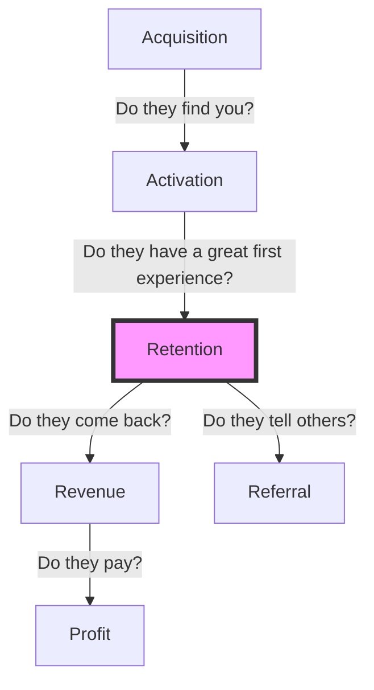

# Module D: Build & Optimize

> **"Speed is a weapon. In today’s fast-paced world, David can unseat Goliath overnight."** — Dan Olsen

## 🎯 The Goal
You have validated your prototype (Module C). Now, we shift gears to **execution** and **optimization**. Your goal is not just to "build software," but to build a **learning machine**. We will use Agile development to ship value quickly and Analytics to measure if that value is real.

In this module, we will:
1.  Establish an **Agile** rhythm to minimize waste.
2.  Define your **AARRR Metrics** (Pirate Metrics) to measure health.
3.  Learn how to **Pivot** based on data (The MarketingReport.com Case Study).
4.  Optimize using the **Equation of Your Business**.

---

## 🧠 Core Concepts

### 1. Agile Development: Building in Small Batches
Don't use "Waterfall" (building everything at once before testing). Use **Agile** (Scrum or Kanban) to build in small increments.
*   **Small Batch Sizes**: Reduces risk and gets feedback faster.
*   **Continuous Integration/Deployment**: Automate testing and releasing to keep the feedback loop tight.
*   **QA is Everyone's Job**: Don't leave quality to the end.

### 2. The AARRR Metrics Framework (Pirate Metrics)
Created by Dave McClure, this is the gold standard for measuring a startup's lifecycle.

*   **Acquisition**: How do users find you? (SEO, SEM, viral).
*   **Activation**: Do they have a "Happy First Experience"? (Sign up, post first photo).
*   **Retention**: **The most important metric for Product-Market Fit.** Do they come back? If retention is poor, nothing else matters.
*   **Referral**: Do they invite friends? (Viral loop).
*   **Revenue**: How do you monetize? (LTV, CAC).

### 3. The Equation of Your Business
Every business can be expressed as a math equation. To optimize, you must peel the layers of the onion.

*   **High Level**: `Profit = Revenue - Cost`
*   **Deeper**: `Revenue = Active Users * ARPU (Average Revenue Per User)`
*   **Deeper (Subscription)**: `Active Users = New Signups + Retained Users`
*   **Actionable**: `New Signups = Website Visitors * Conversion Rate`

**Agent D's Tip**: Focus on the **Metric That Matters Most (MTMM)**. Early on, it is usually **Retention**. Once retention is solid, move to **Conversion**, then **Acquisition**.

---

## 🔍 Case Study Spotlight: MarketingReport.com

This end-to-end case study (Chapter 11) demonstrates the power of the Lean Product Process to **Pivot** before writing expensive code.

### The Setup
*   **Idea**: A "credit report" for marketing data. Let consumers see what direct marketers know about them (e.g., "You own a cat") and correct it.
*   **Hypothesis**: Consumers want transparency and to receive relevant coupons (e.g., dog food instead of cat litter).

### The Test (Wizard of Oz)
*   Instead of building the full database backend, the team built **high-fidelity mockups** and recruited users for in-person testing.
*   **Concept A (Marketing Saver)**: Focus on money-saving offers.
*   **Concept B (Marketing Shield)**: Focus on privacy and blocking junk mail.

### The Result (The Pivot)
*   **Finding 1**: The "core" idea (see your marketing profile) was interesting but not compelling. It was a "nice to have," not a "must-have."
*   **Finding 2**: Users *hated* junk mail. They worried about identity theft from credit card offers in their mailbox.
*   **The Pivot**: The team completely abandoned the "Marketing Report" transparency angle. They pivoted to **JunkmailFreeze**—a service dedicated solely to stopping junk mail to prevent identity theft and save trees.

### The Outcome
*   By pivoting *before* coding, they saved months of engineering time.
*   The new concept had a clear value proposition: **"Stop Junk Mail. Prevent Identity Theft."**
*   Subsequent testing showed much higher willingness to pay.

---

## 🛠️ Actionable Worksheet: Define Your AARRR

Fill out this table to define how you will measure success. Focus on **metrics**, not just concepts.

| Metric Stage | Key Question | Your Metric (Example) | Your Goal / Baseline |
| :--- | :--- | :--- | :--- |
| **Acquisition** | Where do they come from? | *Organic Traffic / CPC Cost* | |
| **Activation** | What is the "Aha!" moment? | *Completed Profile / First Post* | |
| **Retention** | **(Crucial)** Do they return? | *Day 30 Login Rate* | |
| **Revenue** | How do you make money? | *Avg Order Value / LTV* | |
| **Referral** | Do they tell friends? | *Viral Coefficient (K-factor)* | |

### 🚀 Optimization Challenge
1.  **Identify your MTMM** (Metric That Matters Most). Is it Retention? (Hint: It usually is).
2.  **Write out the Equation of Your Business**. Break `Revenue` down into at least 3 levels of sub-metrics.
3.  **Run one A/B Test** this week on a micro-metric (e.g., button color, headline, email subject line) to impact that equation.

> **Final Thought**: "If you can't measure it, you can't improve it." But remember, **analytics tells you WHAT is happening. Customer interviews tell you WHY.** Use both.

---
*Agent D signing off. This concludes our interactive mentorship on The Lean Product Playbook. Go build great things.*
